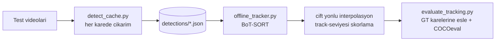

# Drone Videolarinda Nesne Tespiti ve Lokalizasyonu

Hedef sinif: **insan (person)**
Veri seti: [Kaggle Drone Videos](https://www.kaggle.com/datasets/kmader/drone-videos)
Donanim: tek GPU (lokal GTX 1650 degerlendirme, Kaggle T4 egitim)

---

## 1. Problem Tanimi ve Yaklasim Ozeti

Arsiv buyuk olcude etiketsiz ve tamamini etiketlemek gercekci degil. Bu yuzden problem "veri etiketleme problemi" olarak ele alindi: **hangi karelerin etiketlenmesi en cok fayda saglar?**

Cozum uc bagimsiz eksende gelistirildi:

| Eksen | Yaklasim | Cozdugu problem |
|---|---|---|
| A | Doseme (tiled / SAHI benzeri) cikarim | Cozunurluk kaybindan kaynaklanan kucuk nesne kaybi |
| B | Aktif ogrenme + fine-tune | Etiket butcesini en bilgilendirici karelere harcamak |
| C | Zamansal tracking + interpolasyon | Dedektorun tek tek karelerde kacirdigi nesneler |

Bunlar ayni yontemin parametre varyasyonlari degil; sirasiyla **cikarim stratejisi**, **veri secim stratejisi** ve **zamansal cikarsama** katmanlarina mudahale ediyor.

---

## 2. Kullanilan Veri ve Bolme Stratejisi

Once 10 videonun tamami taranip olcek istatistikleri cikarildi ([`analyze_video_inventory.py`](analyze_video_inventory.py) -> [`results/video_inventory_summary.md`](results/video_inventory_summary.md)). Toplam 10.622 kare.

Bolme veriye dayali yapildi: test setine **kucuk nesne orani en yuksek** ve **baseline modelin en cok zorlandigi** videolar alindi.

| Bolum | Videolar | Kare | Etiketli kutu |
|---|---|---|---|
| Test | DJI_0596, Stockflue Flyaround, Surenen Pass Trail Running | 100 (30 karede bir) | 584 |
| Test (filtered) | Stockflue (24 kare / 53 kutu), Surenen (40 kare / 80 kutu) | 64 | 133 |
| Train | Kalan 7 video, aktif ogrenme secimi | 93 | 445 |

Toplam elle etiketlenen: **193 kare, arsivin ~%1.8'i**.

**Kare ornekleme araligi neden 30?** 30 FPS'te ardisik kareler arasindaki bilgi farki neredeyse sifir; her kareyi etiketlemek maliyeti 30 katina cikarirken test setinin bilgi icerigini artirmiyor.

**DJI_0596 hakkinda durust not:** Bu video tek basina 584 kutunun 451'ini (%77) icerir ve 4K yuksek irtifa oldugu icin acik ara en zor videodur. Ana karsilastirma tablolari `instances_filtered.json` (64 kare / 133 kutu) uzerinde uretildi, yani **bu video metriklerin disinda**. Bu, raporlanan skorlari yukari cekiyor; tam GT sonuclari [`results/evaluation/summary.md`](results/evaluation/summary.md) icinde ayrica duruyor.

### Etiketleme Sureci

1. [`prepare_test_set.py`](prepare_test_set.py) videoyu sirali `cap.read()` ile okur, her 30. kareyi `{slug}_f{kare:06d}.jpg` olarak kaydeder (bu adlandirma daha sonra tracking ciktisini GT'ye geri eslemek icin kritik).
2. Ayni script dosemeli Grounding DINO ile **dusuk esikte (0.15) on-etiket** uretir. Amac precision degil recall: operatorun isi "sifirdan kutu cizmek" yerine "fazlaligi silmek" olur, bu da on-etiketleme yanliligini azaltir.
3. CVAT 1.1 XML olarak export edilir, CVAT Community'de elle duzeltilir, COCO JSON olarak geri alinir.

Kullanilan araclar: CVAT (etiketleme), `pycocotools` (metrik), `ultralytics` (YOLO + tracker), HuggingFace `transformers` (Grounding DINO).

---

## 3. Baslangic Yaklasimi (Baseline)

COCO ile onceden egitilmis modeller, **hicbir fine-tune olmadan**, tam kare cikarimla. Tam GT (100 kare / 584 kutu) uzerinde:

| Model | mAP@50 | mAP@50-95 | AP_Small | Opt. F1 | FPS |
|---|---|---|---|---|---|
| yolo11x @640 | 0.135 | 0.089 | 0.029 | 0.192 | 11.3 |
| yolo11x @1536 | 0.477 | 0.266 | 0.207 | 0.507 | 2.5 |
| yolo26x @640 | 0.212 | 0.122 | 0.062 | 0.298 | 12.6 |
| yolo26x @1536 | 0.535 | 0.300 | 0.249 | 0.534 | 2.5 |
| dino_full (zero-shot) | 0.418 | 0.247 | 0.201 | 0.440 | 0.6 |
| **dino_tiled (zero-shot)** | **0.622** | **0.549** | **0.570** | **0.625** | 0.1 |

Her tespit icin guven skoru uretiliyor: YOLO icin sinif olasiligi, DINO icin metin-kutu benzerlik skoru (`person.` prompt'u ile).

### Gozlemlenen Temel Problemler

1. **Kucuk nesne kaybi baskin hata kaynagi.** yolo11x @640'ta AP_Small 0.029, yani uzak insanlar pratikte hic bulunamiyor. Girdi 640'tan 1536'ya cikarildiginda mAP@50 0.135'ten 0.477'ye ciktı: hatanin buyuk kismi mimariden degil **etkin cozunurlukten** kaynakliyor.
2. **DINO'nun gizli yeniden boyutlandirmasi.** Grounding DINO'nun image processor'i girdiyi `shortest_edge=800 / longest_edge=1333`'e kuculuyor. 4K bir kare modele girmeden once 2.88 kat kuculuyor; 60 piksellik bir insan 21 piksele iniyor ve kayboluyor.
3. **DINO halusinasyonu.** Dokusuz bolgelerde (kar, su, gokyuzu) kesitin tamamini "person" olarak kutuluyor ve bu kutular 0.30+ skor alabiliyor. Gercek uzak insanlar 0.17-0.25 aldigi icin **esik yukseltmek ise yaramiyor**: once gercek insanlar kayboluyor, cop kaliyor.

---

## 4. Alternatif Yaklasim A: Dosemeli (Tiled) Cikarim

[`tiled_dino.py`](tiled_dino.py). Kare ortusen parcalara bolunur, her parca ayri modelden gecer, sonuclar global koordinata tasinip birlestirilir.

Teknik kararlar:

- `auto_grid()`: 4K -> 3x3, 720p -> 2x2, 406x720 gibi zaten kucuk kareler -> 1x1 (bolmek fayda saglamaz).
- `tile_windows()`: parcalar **esit boyutta** uretilir, boylece processor her parcaya ayni olceklemeyi uygular.
- Tam kare gecisi de eklenir: parcalar kucuk/uzak insanlari, tam kare parcaya sigmayan buyuk insanlari yakalar.
- `geometric_filter()`: halusinasyon ayirt edici ozelligi **skor degil geometri**. Mutlak piksel alan siniri (parca alaninin %25'i), minimum alan ve en-boy orani kontrolu, birlestirmeden **once** her gecise ayni sinirla uygulanir.
- `suppress_contained()`: NMS'in yakalayamadigi durum. Parca sinirinda kesilen bir insanin yarim kutusu ile tam kutusunun IoU'su dusuk kalir ama yarim kutu tam kutunun **icindedir**; %80 kapsama uzerinde bastirilir.

**Sonuc:** dino_full 0.418 -> dino_tiled 0.622 mAP@50. Asil kazanc kucuk nesnelerde: AP_Small 0.201 -> 0.570 (2.8 kat). Maliyet: 0.6 FPS -> 0.1 FPS.

---

## 5. Alternatif Yaklasim B: Aktif Ogrenme + Fine-tune

[`kaggle_active_learning_selection.ipynb`](kaggle_active_learning_selection.ipynb). Etiket butcesi rastgele degil, **ogretmen-ogrenci uyusmazligina** gore harcanir.

Aday havuzu 7 egitim videosundan 10 karede bir ornekle olusturulur. Her aday icin dosemeli DINO (ogretmen) ve YOLO (ogrenci) ayri ayri kosturulup skor hesaplanir:

```python
al_score = (4.0 * missed_by_yolo      # YOLO'nun ogrenmesi gereken DINO destekli insan
          + 2.5 * small_dino          # AP_Small'i dogrudan hedefler
          + 1.5 * medium_uncertain    # 0.15-0.35 skor bandi: insan etiketi en cok bilgiyi burada verir
          + 1.0 * yolo_only           # YOLO'nun FP urettigi zor arka planlar
          + 2.0 * crowded             # kalabalik sahne: hem kacirma hem duplicate artar
          + 0.2 * len(dino_boxes))
```

Ardindan **cesitlilik filtresi**: ayni videodan `MIN_GAP_FRAMES` yakinindaki kareler elenir. Yoksa skor en yuksek sahnenin 5 ardisik karesi secilir ve bunlar neredeyse ayni bilgiyi tasir.

**Iki tur kosuldu.** Round 1: 50 kare. Round 2: ogrenci artik round 1'de fine-tune edilmis `best.pt`, yani uyusmazlik guncel modele gore hesaplaniyor; onceki turun kareleri havuzdan cikarilip 43 yeni kare secildi. Toplam 93 kare / 445 kutu.

Round 2'de butce 43'te tutuldu cunku havuzun o mesafedeki gercek kapasitesi bu: daha fazlasini istemek round 1 karelerinin komsularini etiketletir, ki bunlar yeni bilgi tasimaz.

### Fine-tune Ayarlari

YOLO ([`kaggle_finetune_yolo.ipynb`](kaggle_finetune_yolo.ipynb)): `imgsz=1536, batch=4, optimizer=AdamW, lr0=0.0001, freeze=23, warmup_epochs=5, epochs=50, save_period=5`.

DINO ([`kaggle_finetune_dino_active.ipynb`](kaggle_finetune_dino_active.ipynb)): `LR=1e-5, EPOCHS=50, GRAD_ACCUM=4`, **dosemeli egitim** (`TILE=True`) - egitim ile cikarim ayni olcekte olsun diye.

Yol boyunca cozulen iki gercek hata:

- **`optimizer=auto` + `nbs=64`**: auto `lr0`'i 0.002'ye cekiyordu ve `batch=4` ile `accumulate=16` olusuyordu, yani epoch basina ~1 optimizer adimi. `cls_loss` patliyor, mAP 0'da kaliyordu.
- **`single_cls=True`**: Ultralytics bunu gorunce `data["nc"]=1` yapiyor ve **pretrained siniflandirma kafasini rastgele yeniden baslatiyor**. Kaldirilip `data.yaml`'a 80 COCO sinif adi yazildi; boylece 1015/1015 tensor transfer oldu ve model "person"i sifirdan ogrenmek zorunda kalmadi.

### Fine-tune Sonuclari (filtered GT: 64 kare / 133 kutu)

| Model | Zero-shot | Round 1 | Round 2 |
|---|---|---|---|
| yolo11x_1536 | 0.643 | 0.745 | **0.760** |
| yolo26x_1536 | 0.737 | 0.758 | 0.749 |
| dino_full | 0.896 | 0.898 | 0.906 |
| dino_tiled | 0.875 | 0.914 | **0.914** |

En buyuk kazanc en zayif modelde: yolo11x +0.117 mAP@50, AP_Small 0.281 -> 0.401. DINO zaten guclu oldugu icin marjinal iyilesti.

**Metodolojik uyari:** Checkpoint secimi (5/10/15/20/25. epoch) GT test seti uzerinde degerlendirilerek yapildi ([`yolo11_select.md`](yolo11_select.md)). Bu bir test seti secimi biasi; ayri bir validation seti ile yapilmasi daha dogru olurdu. Skorlar bu yonde iyimser.

---

## 6. Alternatif Yaklasim C: Zamansal Tracking

Dedektor her kareye bagimsiz bakiyor, ama insan bir onceki ve sonraki karede goruluyor. Bu bilgi kullanilmiyordu.

GT 30 karede bir ornekli ve **track ID icermiyor**, dolayisiyla MOTA/IDF1/HOTA hesaplanamaz. Hedef de bu degil: tracking yogun videoda kosuluyor, kazanc **ayni 64 GT karesinde** COCO metrikleriyle olculuyor. Boylece yeni tablo eski tabloyla birebir karsilastirilabilir kaliyor.



### Tasarim Kararlari

**Dedektor ile tracker ayrildi.** [`tracking/detect_cache.py`](tracking/detect_cache.py) pahali GPU adimini bir kez kosup diske yazar; tracking parametreleri bu onbellek uzerinde saniyeler icinde denenebilir. Ayrica `raw` / `nms` / `botsort` asamalari **ayni dedektor ciktisindan** basladigi icin fark kesin olarak post-processing'e atfedilebilir.

**GT kareleri icin JPEG kullanildi** (`--use-gt-jpeg`). GT kareleri diske JPEG kalite 95 ile yazilmisti; video decode ham kare verir ve bu kucuk fark tespitleri degistirir. Degiskeni izole etmek icin GT karelerinde ayni JPEG okunur.

**BoT-SORT secildi, ByteTrack degil.** Drone ego-hareketi sabit-hiz Kalman varsayimini bozuyor; BoT-SORT'un `gmc_method: sparseOptFlow` kamera hareketi telafisi bu veri setinde belirleyici. `track_low_thresh` 0.1'den **0.03'e** cekildi, cunku uzak insanlar 0.17-0.25 bandinda skor aliyor ve varsayilan esik onlari ikinci esleme turundan tamamen disliyordu.

**Koordinat Kalman'dan degil ham tespitten alinir.** Tracker'in isi kanit uretmek (sureklilik ve kimlik), konum belirlemek degil. Kalman kutusu kullanildiginda mAP@50 ayni kaliyor ama DINO'nun mAP@50-95'i 0.641 -> 0.628'e dusuyordu.

**Silme yerine agirlik dusurme.** Kisa track'ler ve hic takip edilmeyen tespitler atilmaz, skoru `length_factor` ile kirpilir. COCO AP bir esik degil **siralama** metrigi; silmek recall tavanini gereksizce dusururdu.

**Interpolasyon cift yonlu.** Cevrimdisi calistigimiz icin bosluk hem gecmis hem gelecek kareden doldurulabiliyor - online bir tracker bunu yapamaz. Parametreler test setine bakilmadan a priori sabitlendi: `max_gap=15` (0.5 sn), `alpha=0.5`, `min_track_len=3`, `interp_factor=0.9`.

### Kapi Kontrolu

`raw` asamasi eski tablodaki degerleri **birebir** yeniden uretmeli; uretmiyorsa kare hizalamasi bozuktur ve geri kalan her sayi anlamsizdir. Dort modelin dordu de gecti (0.760 / 0.749 / 0.906 / 0.914).

### Tracking Sonuclari (filtered GT)

| Model | Asama | mAP@50 | mAP@50-95 | AP_Small | Opt. P | Opt. R | Opt. F1 |
|---|---|---|---|---|---|---|---|
| yolo11x_1536 | raw | 0.760 | 0.529 | 0.401 | 0.838 | 0.660 | 0.738 |
| yolo11x_1536 | nms | 0.793 | 0.529 | 0.403 | 0.922 | 0.710 | 0.802 |
| yolo11x_1536 | **botsort** | **0.806** | 0.539 | 0.431 | 0.918 | 0.750 | 0.826 |
| yolo26x_1536 | raw | 0.749 | 0.510 | 0.380 | 0.827 | 0.680 | 0.746 |
| yolo26x_1536 | **botsort** | **0.775** | 0.506 | 0.381 | 0.922 | 0.710 | 0.802 |
| dino_full | raw | 0.906 | 0.650 | 0.579 | 0.974 | 0.840 | 0.902 |
| dino_full | **botsort** | **0.915** | 0.641 | 0.563 | 0.930 | 0.900 | 0.915 |
| dino_tiled | raw | 0.914 | 0.665 | 0.579 | 0.958 | 0.860 | 0.907 |
| dino_tiled | **botsort** | **0.930** | 0.670 | 0.576 | 0.944 | 0.880 | 0.911 |

Tracking her dort dedektorde de mAP@50'yi artirdi. Recall kazanci en belirgin: yolo11x 0.660 -> 0.750, dino_full 0.840 -> 0.900.

---

## 7. Genel Sonuc: Katmanlarin Birikimli Etkisi

Ayni 64 kare / 133 kutu uzerinde, mAP@50:

| Asama | yolo11x_1536 | dino_tiled |
|---|---|---|
| Zero-shot (COCO pretrained) | 0.643 | 0.875 |
| + aktif ogrenme fine-tune (round 1) | 0.745 | 0.914 |
| + fine-tune (round 2) | 0.760 | 0.914 |
| + kare ici NMS/kapsama bastirma | 0.793 | 0.914 |
| + BoT-SORT zamansal iyilestirme | **0.806** | **0.930** |

Toplam kazanc: yolo11x +0.163, dino_tiled +0.055 mAP@50.

---

## 8. Hata Analizi

### Basarili
- **Surenen Pass Trail Running**: dino_tiled + botsort mAP@50 **0.991**, recall 0.980. Tek ve buyuk hedef, kararli takip.
- Dosemeli cikarim kucuk nesnelerde AP_Small'i 2.8 kat artirdi (0.201 -> 0.570).
- Fine-tune sonrasi YOLO'nun precision'i belirgin yukseldi (0.536 -> 0.838).

### Basarisiz / Zayif
- **Stockflue Flyaround en zor video.** yolo11x botsort ile sadece 0.515 mAP@50; %59.6 COCO-small orani ve surekli donen kamera. dino_tiled ile 0.828'e cikiyor, yani buradaki hata **dedektor kapasitesi** kaynakli, zamansal degil.
- **DJI_0596** metriklerin disinda tutuldu. Tam GT'de baseline yolo11x @640 bu videoda 0 tespit yapmisti.
- **Interpolasyon kazanci beklenenden kucuk.** `conf>=0.25` calisma noktasinda dedektorun kacirdigi kutulardan interpolasyonla gelen: yolo11x 2/38, yolo26x 1/43, dino_full 2/15, dino_tiled 1/12. Yani tracking kazancinin buyuk kismi interpolasyondan degil **NMS + track-seviyesi yeniden skorlamadan** geliyor. Bunun nedeni yapisal: GT 30 karede bir ornekli, tracking'in doldurdugu kareler ise cogunlukla GT'de karsiligi olmayan aradaki karelerdir; kazanc videoda goruluyor ama seyrek GT bunu tam olcemiyor.
- **yolo26x round 2'de geriledi** (0.758 -> 0.749). 133 kutuluk sette bu birkac kutuluk bir fark; gurultu olarak yorumlanmali.

### Belirsiz
- **Surenen'de dino_tiled ~ dino_full.** `auto_grid(406, 720)` -> `(1,1)` donduruyor, yani bu videoda doseme devreye girmiyor. Filtered GT'nin 40/64'u Surenen oldugu icin iki modelin yakinligi (0.906 vs 0.914) buradan kaynakliyor; ortalama bu detayi gizliyor.
- **Kucuk orneklem.** 133 kutuda birkac kutuluk degisim oranlarda buyuk gorunuyor. Video bazli kirilim bu yuzden ayrica raporlandi.
- **Kalman vs ham kutu takasi dedektore bagli.** DINO'da ham kutu daha iyi (lokalizasyonu zaten temiz), YOLO'da Kalman gurultulu kutulari duzeltiyor. Tek bir dogru tercih yok.

---

## 9. Metrik Secimi Gerekcesi

- **mAP@50-95 ve mAP@50**: COCO standardi, esikten bagimsiz siralama kalitesini olcer. Tek bir conf esigi secmek zorunda kalmadan modelleri karsilastirmayi saglar.
- **AP_Small / AP_Medium**: Bu problemin ana hata kaynagi nesne boyutu oldugu icin ayrilmis. Ortalama mAP, kucuk nesne kaybini gizliyor.
- **Optimal P / R / F1**: PR egrisi uzerinde F1'i maksimize eden nokta. Pratikte secilecek calisma noktasinin ne verdigini gosterir; mAP bunu soylemez.
- **s/kare ve FPS**: Dogruluk-maliyet takasini gorunur kilar. dino_tiled en dogru ama 0.3 FPS.
- **Interpolasyonla kurtarilan kutu sayisi**: mAP bir siralama metrigi oldugu icin "kac kutu geri geldi" sorusuna cevap vermiyor; bu sayac tracking'in recall katkisinin dogrudan kaniti.

MOT metrikleri (MOTA/IDF1) **bilincli olarak kullanilmadi**: GT'de track ID yok ve 30 kare arayla kimlik atamak belirsiz olurdu.

---

## 10. Hesaplama Maliyeti

Cikarim (1874 kare, Stockflue + Surenen):

| Model | s/kare | Yogun cikarim | Etkin FPS |
|---|---|---|---|
| yolo11x_1536 | 0.43 - 0.47 | ~14 dk | 2.5 |
| yolo26x_1536 | 0.44 - 0.49 | ~15 dk | 2.4 |
| dino_full | 1.74 | ~54 dk | 0.6 |
| dino_tiled | 1.65 (1x1) - 8.57 (2x2+tam) | ~131 dk | 0.1 - 0.3 |

Toplam onbellek uretimi ~3.6 saat. Tracking asamasi onbellek uzerinde saniyeler surer (yalnizca video decode + hafif esleme).

Egitim: Kaggle T4, 50 epoch, `freeze=23` ile YOLO basina yaklasik 1-2 saat; DINO dosemeli egitim benzer mertebede.

**Pratik oneri:** dino_tiled en dogru ama 0.1-0.3 FPS ile gercek zamanli degil. Uygulanabilir kombinasyon **yolo11x + BoT-SORT** (0.806 mAP@50, ~2.5 FPS); dino_tiled cevrimdisi ogretmen/analiz rolunde birakilmali.

---

## 11. Guclu ve Zayif Yonler

**Guclu**
- Arsivin yalnizca %1.8'i etiketlenerek 0.930 mAP@50'ye ulasildi.
- Uc bagimsiz iyilestirme ekseni (cikarim, veri secimi, zamansal) ayri ayri olculebilir sekilde ayrildi.
- Kapi kontrolu ile kare hizalamasi dogrulandi; tracking sonuclari eski tabloyla birebir karsilastirilabilir.
- Halusinasyon skor yerine geometriyle filtrelendi - esik yukseltmenin ise yaramadigi durumda dogru cozum.
- Tracking parametreleri test setine bakilmadan sabitlendi.

**Zayif**
- Test seti kucuk (filtered 133 kutu) ve en zor video (DJI_0596) metriklerin disinda.
- Checkpoint secimi GT test setine bakilarak yapildi - iyimser bias.
- Aktif ogrenme etiketleri tek kisi tarafindan uretildi, etiketleyici tutarliligi olculmedi.
- Interpolasyon cift yonlu, yani **nedensel degil**: gercek zamanli sistemde yalnizca `track_buffer` ile geriye donuk doldurma mumkun olurdu.
- On-etiketler DINO'dan geldigi icin GT'de kalinti ogretmen yanliligi olabilir.

---

## 12. Tekrar Uretilebilirlik

```bash
# 1. Envanter ve olcek analizi
python3 analyze_video_inventory.py

# 2. Test seti kareleri + DINO on-etiket (CVAT XML)
python3 prepare_test_set.py

# 3. Baseline / fine-tune degerlendirmesi
python3 evaluate_on_gt.py --models yolo11x_1536,yolo26x_1536,dino_full,dino_tiled

# 4. Tracking: yogun tespit onbellegi
python3 tracking/detect_cache.py \
  --models yolo11x_1536,yolo26x_1536,dino_full,dino_tiled \
  --videos Stockflue_Flyaround,Surenen_Pass_Trail_Running

# 5. Cevrimdisi tracking asamalari
python3 tracking/offline_tracker.py \
  --models yolo11x_1536,yolo26x_1536,dino_full,dino_tiled \
  --stages raw,nms,botsort

# 6. GT uzerinde degerlendirme
python3 tracking/evaluate_tracking.py \
  --models yolo11x_1536,yolo26x_1536,dino_full,dino_tiled \
  --stages raw,nms,botsort

# 7. Yan yana demo videosu
python3 tracking/render_demo.py --slug Stockflue_Flyaround --model yolo11x_1536
```

Egitim Kaggle uzerinde: [`kaggle_active_learning_selection.ipynb`](kaggle_active_learning_selection.ipynb), [`kaggle_finetune_yolo.ipynb`](kaggle_finetune_yolo.ipynb), [`kaggle_finetune_dino_active.ipynb`](kaggle_finetune_dino_active.ipynb).

### Ciktilar

| Cikti | Yol |
|---|---|
| Envanter | [`results/video_inventory_summary.md`](results/video_inventory_summary.md) |
| Baseline (tam GT) | [`results/evaluation/summary.md`](results/evaluation/summary.md) |
| Zero-shot (filtered) | [`results/evaluation/summary_filtered.md`](results/evaluation/summary_filtered.md) |
| Fine-tune round 1 / 2 | [`results/evaluation/summary_tuned.md`](results/evaluation/summary_tuned.md), [`results/evaluation/summary_tuned_round2.md`](results/evaluation/summary_tuned_round2.md) |
| Tracking | [`results/evaluation/summary_tracking.md`](results/evaluation/summary_tracking.md) |
| Checkpoint secim kaydi | [`yolo11_select.md`](yolo11_select.md) |
| Demo videosu | `results/tracking/demo/Stockflue_Flyaround__yolo11x_1536__demo.mp4` |
| Ornek kare | `results/tracking/demo/ornek_kare_258.jpg` |

---

## 13. Kaynaklar

- Drone Videos veri seti: https://www.kaggle.com/datasets/kmader/drone-videos
- Grounding DINO: `IDEA-Research/grounding-dino-base` (Liu et al., 2023)
- Ultralytics YOLO11 / YOLO26: https://github.com/ultralytics/ultralytics
- BoT-SORT: Aharon et al., 2022 - https://github.com/NirAharon/BoT-SORT
- ByteTrack: Zhang et al., 2022
- SAHI (dosemeli cikarim fikri): Akyon et al., 2022
- COCO metrikleri: `pycocotools`
- CVAT: https://www.cvat.ai
